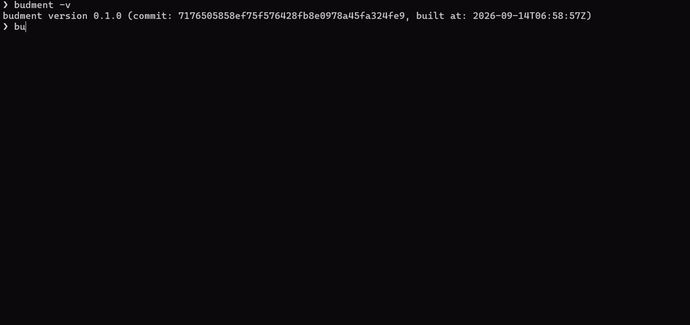

<div align="center">

  

  <p><strong>Scenarios as AST, Logic as Code.</strong></p>

  <p>Define workflows as code. Compile them into deterministic execution plans.</p>

  <p>
    <a href="#overview">Overview</a> •
    <a href="#core-principles">Core Principles</a> •
    <a href="#quick-start">Quick Start</a> •
    <a href="#cli-workflow">CLI Workflow</a> •
    <a href="https://budment.com/docs">Full Documentation</a>
  </p>

  <br />
  

</div>

---

## Overview

Budment uses a **two-phase execution model** that separates scenario compilation from runtime execution:

1. **Compilation:** Scenarios are evaluated once in an isolated compiler and compiled into an immutable **Abstract Syntax Tree (AST)** with no network or external side effects.

2. **Execution:** The native engine executes the compiled AST using high-concurrency workers. Script runtimes are invoked only when custom hooks require them.

---

## Core Principles

- **Declarative Execution Graph:** Workflows are represented as execution nodes, enabling deterministic flow analysis and execution.
- **Context-Aware SDK:** `budment` primitives automatically adapt to their execution context.
- **Resource Efficiency:** A lightweight architecture minimizes runtime overhead and infrastructure requirements.
- **Test as Code:** Scenarios are authored as type-safe code with IDE and Git support.
- **Test as Docs:** `budment plan` renders scenarios as inspectable execution plans, reducing the time needed to understand, preview, and maintain workflows.
- **Dynamic Expressions:** The DSL supports dynamic expressions for common test data and runtime values.
- **CI/CD Quality Gates:** Thresholds produce deterministic results for automated pipelines.
---

## Quick Start

### 1. Install the Budment CLI

```bash
curl -fsSL https://budment.com/install.sh | bash
```

Verify the installation:

```bash
budment --version
```

### 2. Install the TypeScript SDK

Install the companion DSL builder in your workspace:

```bash
npm install -D budment
```

### 3. Write a Scenario

Create a test scenario (e.g., `test.ts`). Declare requests, assertions, and pacing delays:

```typescript
import { http, sleep, random } from '@budment/sdk';

export const config = {
    vus: 10,
    duration: "30s",
    thresholds: {
        "http_req_duration": "p95<500ms",
        "http_req_failed": "rate<0.01",
    },
};

export default [
    http.post("https://api.example.com/orders")
        .before({
            body: {
                order_id: `ord_${random.string(8)}`,
                request_uuid: random.uuid()
            }
        })
        .after({
            expect: { status: 201 }
        }),

    sleep(0.5) // Native Go pacing delay
];
```

## CLI Workflow

### Phase 1: Inspect the Execution Plan

Compile the scenario to audit the execution hierarchy, verify dependency order, and review hook placement without initiating network requests:

```bash
budment plan test.ts
```

For full tree inspection including node IDs and mutation metadata:

```bash
budment plan test.ts --detail
```

### Phase 2: Execute the Load Pipeline

Run the scenario against target endpoints:

```bash
budment run test.ts
```

Override parameters dynamically for CI/CD runners:

```bash
budment run test.ts --vus 100 --duration 5m --quiet
```

## Documentation

Full guides and architectural specifications are available at [budment.com/docs](https://budment.com/docs):

- [System Architecture & Runtime Engine](https://budment.com/docs/ARCHITECTURE)
- [Scenario Lifecycle & Multi-Stage Coordination](https://budment.com/docs/guide/01-lifecycle)
- [HTTP Pipelines, Mutations & Assertions](https://budment.com/docs/guide/02-http)
- [Control Flow Nodes (Branch, Loop, Poll)](https://budment.com/docs/guide/03-control-flow)
- [Memory Scopes & Native Templates](https://budment.com/docs/guide/04-state)
- [Metrics, SLA Gates & Custom Telemetry](https://budment.com/docs/guide/05-metrics-thresholds)
- [FAQ & Best Practices](https://budment.com/docs/guide/06-faq-best-practices)
- [CLI Command Reference](https://budment.com/docs/reference/cli)

## License

Budment is open-source software licensed under the [MIT License](./LICENSE).