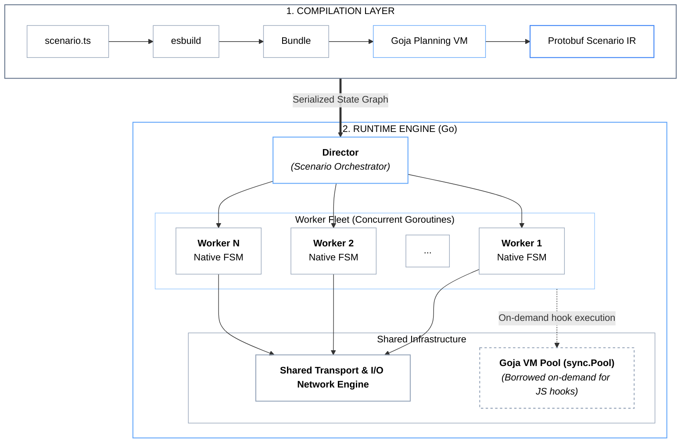
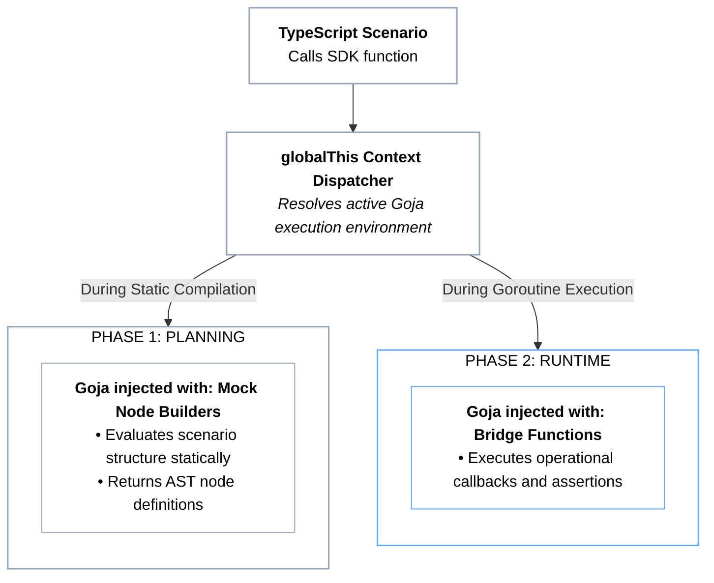
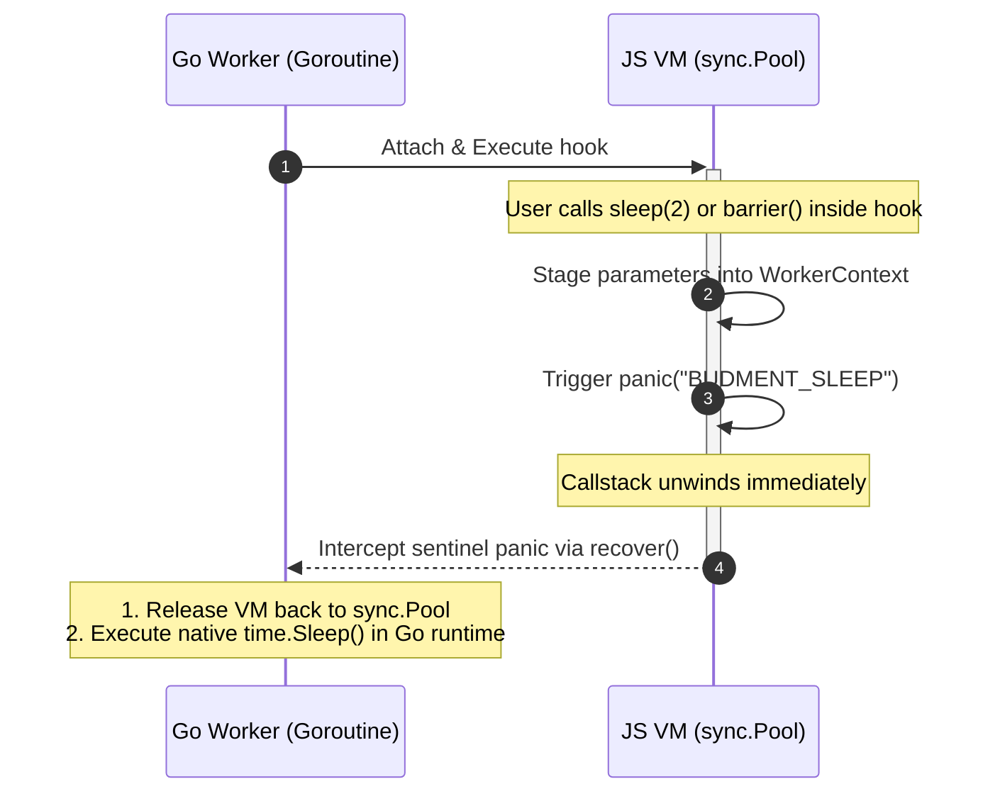

# System Architecture

Budment is architected around a decoupled, compilation-based execution model. Test scenarios defined in TypeScript are translated into an intermediate **Static Execution Graph**, separating high-level workflow definitions from the high-throughput, low-latency requirements of native systems execution.

## 1. Two-Phase Execution Lifecycle

### Phase 1: Static Graph Compilation (The Plan Phase)

The engine executes the input bundle within an isolated, side-effect-free compiler VM:

1. **Dependency Packaging:** The scenario definition is bundled in-memory using an embedded compilation pipeline.
2. **DSL Evaluation:** The compiler VM evaluates the bundle against mock builders. Calls to structural definitions (`http.get`, `branch`, `poll`) construct intermediate node descriptors rather than executing network I/O.
3. **Graph Assembly:** The descriptors compile into an immutable Directed Graph (IR) encoded via Protobuf structures, preserving pipeline hierarchy, conditions, and metadata.

### Phase 2: Native FSM Execution (The Run Phase)

Once compilation concludes, the compiler VM is fully decommissioned and the native runtime engine takes control:

1. **Scenario Scheduling:** The `Director` allocates execution groups according to configured order dependencies (`Order`) and timing offsets (`StartAt`).
2. **Worker Allocation:** Virtual Users (VUs) execute as lightweight Go goroutines governed by a Finite State Machine (FSM).
3. **Deterministic State Walking:** Each worker traverses the pre-compiled graph nodes sequentially or conditionally without querying an external script interpreter for routing decisions.

## 2. The Three-Tier Node Taxonomy

Nodes within the Budment architecture are categorized into three distinct functional tiers, governing where and how they are evaluated:

| **1. STRUCTURAL NODES**                                         | **2. OPERATIONAL NODES**                                                          | **3. EXPRESSION NODES**                                                            |
| --------------------------------------------------------------- | --------------------------------------------------------------------------------- | ---------------------------------------------------------------------------------- |
| `Action` (HTTP)                                                 | `Log` / `Abort` / `Fail`                                                          | Context Get                                                                        |
| `Branch` (if/else)                                              | `Script`                                                                          | Random Generators                                                                  |
| `Match` (switch)                                                | `Set` / `Distribute`                                                              | Environment Config                                                                 |
| `Loop` (for/while)                                              | `Metric`                                                                          | Binary / File Buffers                                                              |
| `Poll` (retry)                                                  | `Barrier`/ `Sleep`                                                                | Execution Info                                                                     |
| **Governs topology and routing in the static execution graph.** | **Represents discrete lifecycle actions executed natively by worker goroutines.** | **Resolves dynamic values and expressions without adding structural graph nodes.** |

### Tier 1: Structural Flow Nodes (Graph Topology)

Structural nodes define the branching, iteration, and protocol routing boundaries of a scenario.

- **Nodes:** `ActionNode` (HTTP), `BranchNode`, `MatchNode`, `LoopNode`, `PollNode`.
- **Behavior:** Compiled during Phase 1 into native Go graph structures. During Phase 2, the worker FSM evaluates conditional routing directly in native Go code. JavaScript is only consulted if a condition explicitly requires dynamic hook evaluation.

### Tier 2: Operational Executable Nodes (Lifecycle Actions)

Operational nodes represent discrete instructions executed along a pipeline path.

- **Nodes:** `SleepNode`, `LogNode`, `SetNode`, `DistributeNode`, `MetricNode`, `AbortNode`, `FailNode`, `BarrierNode`...
- **Dual-Context Role:**

  - _In Phase 1:_ They emit lightweight AST descriptor nodes containing configuration parameters (e.g., target duration, metric labels, variable keys).
  - _In Phase 2:_ They trigger immediate native system actions: goroutine timers for sleep, atomic counters for metrics, or cross-worker coordination via `BarrierManager`.

### Tier 3: Expression & Dynamic Data Nodes (Value Providers)

Expression nodes provide dynamic data resolution without adding structural nodes to the AST graph.

- **Nodes:** `get()`, `env()`, `open()`, `random.*`, `info.*`.
- **Template Substitution vs. Hook Evaluation:**

  - _Declarative Templates:_ In static declarations, these nodes compile down to native template tokens (e.g., `{{@env:API_KEY:default}}`, `{{@random:uuid}}`, `{{@open:/path/file:b}}`). At runtime, the native Go template engine interpolates these tokens.
  - _Imperative Hooks:_ Inside JavaScript callbacks, these nodes interact directly with the attached `WorkerScope` via memory bridges, permitting zero-copy reads and writes to worker-local or scenario-shared memory.

## 3. The "Blind SDK" Pattern

The TypeScript SDK contains **no business logic or operational runtime code**. It serves strictly as a type-safe definition layer.

All functions exported by the SDK are direct bindings to `globalThis`. The Go engine binds concrete implementations into the VM based entirely on the active lifecycle phase:

- During Phase 1, `sleep(1)` returns a descriptor object `{ build: () => ({ type: "sleep", duration: 1 }) }`.
- During Phase 2, calling `sleep(1)` within an imperative hook records the sleep interval and yields thread control back to the native Go runtime.

## 4. Inter-Language Yielding: The Panic-Recovery Protocol

Executing blocking operations (such as timers, abort signals, or synchronization barriers) from within synchronous JavaScript callbacks requires transferring control without blocking operating system threads or locking the shared VM pool.

Budment implements a deterministic **Panic-Recovery Control Transfer Protocol**:

1. **Parameter Staging:** When a blocking operation (`sleep`, `barrier`, `abort`) is invoked inside a JS hook, the Go bridge captures the relevant metadata into the active worker context.
2. **Stack Termination:** The bridge triggers a controlled panic with a known sentinel string (e.g., `BUDMENT_SLEEP`, `BUDMENT_ABORT`). This immediately unwinds the JavaScript execution stack, terminating script execution safely.
3. **Host Interception:** The enclosing Go worker intercepts the sentinel panic via `recover()`, disengages the VM, and returns the instance to the `sync.Pool`.
4. **Native Execution:** The blocking operation is carried out natively in Go using standard synchronization primitives (e.g., `time.NewTimer`, channels, or `sync.Cond`).
