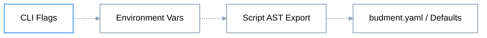

# Scenario Lifecycle & Orchestration

Budment separates test definitions into deterministic execution phases. This design guarantees that administrative initialization, resource distribution, and high-throughput concurrent loops remain strictly isolated throughout test execution.

---

## 1. Scenario Declaration Paradigms

Budment supports two primary authoring styles. Both compile directly into identical Directed Acyclic Graph (DAG) structures inside the Go runtime.

### Paradigm A: Declarative ES Module Exports (Recommended)

Ideal for standard load test scripts and CI/CD pipelines. Uses native JavaScript/TypeScript module exports.

```typescript
import { http, sleep, metrics } from '@budment/sdk';

// 1. Scenario configuration & SLA Quality Gates (alias: export const options = { ... })
export const config = {
    vus: 10,
    duration: "30s",
    thresholds: {
        "http_req_duration": "p95<200ms",
        "http_req_failed": "rate<0.01"
    }
};

// 2. Setup Phase: Executed strictly once before any concurrent workers spawn
export const setup = [
    http.get("https://api.example.com/health")
        .after({ expect: { status: 200 } })
];

// 3. Execution Phase: Traversed concurrently by active Virtual Users (VUs)
export default [
    http.get("https://api.example.com/items"),
    sleep(0.5),
    metrics.counter("completed_passes", 1)
];
```

### Paradigm B: Fluent Builder Pattern

Ideal for complex scenarios requiring strict TypeScript type-checking, dynamic programmatic generation, or reusable modular test components.

```typescript
import { scenario, http, sleep } from '@budment/sdk';

export const checkoutScenario = scenario("Checkout Flow")
    .config({
        vus: 20,
        duration: "1m",
        order: 1
    })
    .setup(
        http.post("https://api.example.com/auth/admin-token")
            .after({ extract: { "token": "admin_jwt" } })
    )
    .execution(
        http.get("https://api.example.com/cart"),
        sleep(1)
    );
```

## 2. Phase Execution Lifecycle

Every Budment execution flows through a deterministic sequence:


### Phase 1: Setup Pipeline

- **Execution Boundary:** Executed strictly **once** using a dedicated setup worker (`VU 0`, `Iteration 0`) prior to spawning the load generator worker pool.
- **Failure Guard:** If any assertion fails or an unhandled exception (`abort()`) occurs during `setup`, the engine immediately halts the run and exits with code `1`, preventing unverified load against target environments.
- **State Seeding:** Data initialized via `local.set()`, `global.set()`, or `distribute()` is guaranteed to be fully synchronized and available to all workers before Phase 2 begins.

### Phase 2: Execution Pipeline

- **Worker Traversal:** Concurrency scales according to the scenario's configured Virtual Users (`vus`) or dynamic ramping profile (`stages`).
- **Iteration Isolation:** Each worker iterates through the configured pipeline steps. Once an iteration finishes, worker-scoped memory is cleaned to prevent state leakage between cycles.
- **Native Yield:** When timers (`sleep`) or synchronization primitives (`barrier`) are encountered, execution yields control back to the Go concurrency scheduler without blocking operating system threads.

### Phase 3: Engine Drain & SLA Quality Gates

- **Connection Drain:** Once scenario duration or target iterations are exhausted, active HTTP connections finish their in-flight cycles gracefully.
- **SLA Evaluation:** The AssertionManager inspects cumulative metrics (`p95`, `p99`, error rates, and custom counters). Threshold violations result in a non-zero process exit code for CI/CD status reporting.

## 3. Multi-Scenario Orchestration

Budment supports running multiple independent scenarios within a single script. Scenarios can run sequentially via execution tiers (`order`), simultaneously, or with scheduled start times (`startAt`).

### Declarative Multi-Scenario Script

```typescript
import { http, sleep } from '@budment/sdk';

// Global options applied to all scenarios unless overridden locally
export const options = {
    thresholds: { "http_req_failed": "rate<0.01" }
};

// Scenario 1: Cache Warming (Runs first in Order 1)
export const warmUpPhase = {
    config: { 
        vus: 2, 
        duration: "15s", 
        order: 1 
    },
    setup: [
        http.get("https://api.example.com/health")
    ],
    execution: [
        http.get("https://api.example.com/cache/warm"),
        sleep(1)
    ]
};

// Scenario 2: Main Traffic (Runs in Order 2 after Order 1 completely finishes)
export const peakTraffic = {
    config: { 
        vus: 50, 
        duration: "2m", 
        order: 2 
    },
    execution: [
        http.get("https://api.example.com/search?q=budment"),
        sleep(0.2)
    ]
};

// Scenario 3: Background Batch Sync (Runs at an exact scheduled offset)
export const backgroundSync = {
    config: { 
        vus: 5, 
        duration: "1m", 
        startAt: "30s" // Optional delay after order 2 starts
    },
    execution: [
        http.post("https://api.example.com/sync")
    ]
};
```

## 4. Scenario Configuration & Precedence

### Scenario Configuration Schema

Configurations declared in `config` or `options` accept the following fields:

| **Field** | **Type** | **Default** | **Description** |
| --- | --- | --- | --- |
| `vus` | `number` | `1` | Number of concurrent Virtual Users (workers) assigned to this scenario. |
| `duration` | `string` | `""` | Target duration for this scenario (e.g., `"30s"`, `"5m"`). |
| `maxDuration` | `string` | `""` | Hard upper time boundary before the scenario is forcefully terminated. |
| `iterations` | `number` | `null` | Total iterations across all VUs. When reached, the scenario stops. |
| `order` | `number` | `0` | Execution priority group. Lower order values complete 100% before the next tier starts. |
| `startAt` | `string` | `""` | Duration offset to wait after its designated order group is unlocked before firing requests. |
| `stages` | `Stage[]` | `[]` | Dynamic load ramping curve (`[{ duration: "1m", target: 50 }]`). Overrides `vus`. |
| `thresholds` | `Record<string, string>` | `{}` | Metric pass/fail quality criteria (e.g. `{"http_req_duration": "p95<250ms"}`). |
| `tags` | `Record<string, string>` | `{}` | Key-value metadata tags appended to all metrics emitted by this scenario. |
| `insecureSkipTLS` | `boolean` | `false` | Disables SSL/TLS server certificate validation for this scenario. |

### Configuration Hierarchy & Override Order

Budment resolves configuration conflicts using a strict precedence order. Higher levels always override lower levels:



- Any configuration declared in `export const config` or `export const options` overrides defaults set in `budment.yaml`.
- Environment variables (e.g., `BUDMENT_VUS`, `BUDMENT_DURATION`) and CLI parameters override both file configurations at runtime.

## 5. Reserved Export Keywords

To ensure your scenarios compile as intended, avoid using the following reserved export identifiers as scenario names:

| **Identifier** | **Purpose** |
| --- | --- |
| `default` | Reserved for the primary execution pipeline in single-scenario tests. |
| `config` / `options` | Reserved for scenario and engine configuration definitions. |
| `setup` | Reserved for global initialization steps executed before Phase 2. |