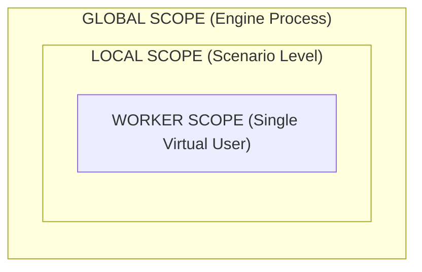

# State Management, Test Data & Templates

Budment provides an isolated memory model and high-performance template interpolation in Go. Variables can be seamlessly embedded into static requests or managed programmatically inside JavaScript hooks.

## 1. The AST Compilation Principle

Budment operates on a decoupled **Two-Phase Architecture**. Understanding this is critical for writing robust scenarios:

- **Phase 1 (Static Planning):** Budment executes your global code (outside `() => {}` hooks) to compile a static **Abstract Syntax Tree (AST)**. Data providers like `get()` and `env()` act as **Proxies**. They do not return real data; they generate template tokens (e.g., `"{{user_id}}"`) to build the execution blueprint.
- **Phase 2 (Runtime Execution):** The Go FSM executes the static AST concurrently across all Virtual Users (VUs). Any dynamic logic wrapped inside `() => {}` (Runtime Hooks) is dispatched to the JavaScript VM on demand. Inside hooks, `get()` and `env()` cross the bridge to return the actual, real-time memory state.

Because of this design, the engine achieves massive throughput by reusing the same static blueprint (AST) for all workers, only dipping into the JavaScript VM when dynamic logic or state mutation is strictly necessary.

## 2. Memory Scopes

State is strictly divided into three isolation boundaries:



### Scope Capabilities

| **Scope**        | **API Primitives**        | **Isolation Boundary** | **Reset Frequency**  | **Primary Purpose**                                        |
| ---------------- | ------------------------- | ---------------------- | -------------------- | ---------------------------------------------------------- |
| **Worker Scope** | `get(k)`, `set(k, v)`     | Single Virtual User    | **Every iteration**  | Storing session tokens, loop counters, and iteration data. |
| **Local Scope**  | `local.get/set/push/pop`  | Single Scenario        | Persists across test | Shared FIFO queues, scenario-wide caching.                 |
| **Global Scope** | `global.get/set/push/pop` | Engine Process         | Persists across test | Cross-scenario signaling, global rate limit counters.      |

## 3. Dataset Distribution

To ensure virtual users consume unique credentials use `distribute(key, items)` inside the `setup` phase.

At the start of **every iteration**, the Go FSM automatically retrieves the next available item (round-robin) and securely injects it into the active Worker Scope using the provided key.

**TypeScript**

```typescript
import { http, distribute, get, script } from "@budment/sdk";

export const setup = [
  script(() => {
    const userPool = [
      { user: "alice", pass: "Secret1" },
      { user: "bob", pass: "Secret2" },
    ];

    // Partitions records round-robin across active workers
    distribute("active_identity", userPool);
  }),
];

export default [
  // resolves deep object properties
  http.post("https://api.example.com/login").before({
    body: {
      username: `${get("active_identity").user}`,
      password: `${get("active_identity").pass}`,
    },
  }),
];
```

## 4. Native Go Templates & SDK Resolution

When you write standard JavaScript template literals outside of hooks, you don't need to memorize Budment's internal token syntax. Use the intuitive SDK functions, and the compiler will map them to Native Go Templates for high-speed execution.

### Declarative Resolution Table (Used Outside Hooks)

This table illustrates how intuitive SDK calls compile into native tokens when used in static builders (Phase 1), which the Go FSM then resolves per-iteration during Phase 2:

| SDK Call in Template Literal | Compiles To (Under-the-hood) | Native Go Runtime Action (Per Iteration)               |
| ---------------------------- | ---------------------------- | ------------------------------------------------------ |
| `${get('session_id')}`       | `{{session_id}}`             | Exact key lookup from **Worker Scope**.                |
| `${get('user').profile.id}`  | `{{user}{profile}{id}}`      | Deep property resolution.                              |
| `${local.pop('tickets')}`    | `{{@pop:local:tickets}}`     | Pops the next value from a Local FIFO queue.           |
| `${env('PORT', '80')}`       | `{{@env:PORT:80}}`           | Reads system environment variable.                     |
| `${random.uuid()}`           | `{{@random:uuid}}`           | Generates a standard RFC 4122 UUID v4 natively.        |
| `${random.string(16)}`       | `{{@random:string:16}}`      | Generates an alphanumeric string of length 16.         |
| `${random.integer(1, 100)}`  | `{{@random:int:1:100}}`      | Generates a uniformly distributed integer.             |
| `${random.pick(['A','B'])}`  | `{{@random:pick:A,B}}`       | Selects one option at random from the list.            |
| `${open('./data.json')}`     | `{{@open:./data.json:r}}`    | Streams file content from disk with in-memory caching. |

### System Context Metadata

The engine automatically injects routing and context metadata into every active worker's memory scope. These can be accessed dynamically inside hooks via the `info` object, or embedded directly into static URLs using the SDK:

| SDK Property     | Equivalent Template Token | Description                                             |
| ---------------- | ------------------------- | ------------------------------------------------------- |
| `info.vuId`      | `{{__VU_ID__}}`           | Unique global numeric ID of the virtual user.           |
| `info.iteration` | `{{__ITER__}}`            | Current 0-indexed iteration count of the active worker. |
| `info.scenario`  | `{{__SCENARIO__}}`        | The string name of the currently running scenario.      |

**Example of Seamless Integration:**

```typescript
import { http, random, get, env, info } from "@budment/sdk";

export default [
  // Outside a hook: The SDK returns tokens and resolves this string without entering the VM.
  http
    .get(
      `http://api.example.com:${env("PORT")}/search?q=${random.string(8)}&iter=${info.iteration}`,
    )
    .before({
      headers: {
        Authorization: `Bearer ${get("session_token")}`,
      },
    }),
];
```
