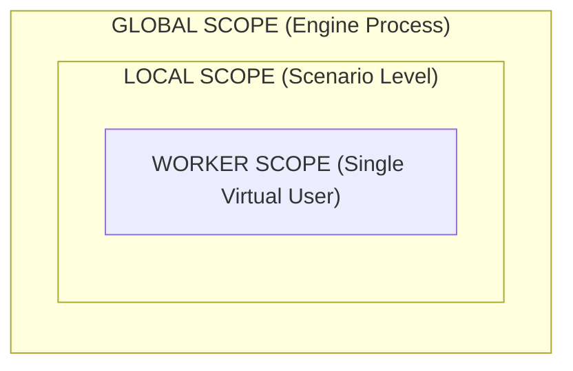

---

title: State Management, Test Data & Templates
description: Technical guide to memory scopes, data distribution, template interpolation, and the two-phase lifecycle rules.
---

# State Management, Test Data & Templates

Budment provides an isolated memory model and a high-performance, template interpolation in Go. Variables can be interpolated directly into static requests or managed programmatically inside JavaScript hooks.

## 1. The Golden Rule: Polymorphic SDK & Two-Phase Execution

Budment operates on a strictly decoupled **Two-Phase Architecture** (Static Planning vs. Native Runtime). 

To make developer experience seamless, SDK data providers (`get`, `random`, `env`, `open`) are **polymorphic**. Their behavior changes entirely depending on *where* you call them:

1. **Outside JS Hooks (Phase 1 - Static DSL):** When you use SDK functions in static request builders (e.g., `` http.get(`https://api.example.com/users/${random.uuid()}`) ``), they act as mocks. They simply return static template tokens (like `"{{@random:uuid}}"`) to build the execution graph.
2. **Inside JS Hooks (Phase 2 - Runtime):** When you call these exact same functions inside a runtime callback (e.g., `.before(req => { const id = random.uuid(); })`), they cross the Goja bridge and return the **actual, real-time generated values**.

> **Crucial Takeaway:** Because static DSL builders are evaluated only once during compilation, any dynamic calculations, `if/else` conditions, or object destructuring (e.g., `user.password`) that must change *per iteration* **MUST be placed inside a JavaScript Hook**.

## 2. Memory Scopes Architecture

State is strictly divided into three isolation boundaries:



### Scope Capabilities

| **Scope**        | **API Primitives**        | **Isolation Boundary** | **Reset Frequency**  | **Primary Purpose**                                        |
| ---------------- | ------------------------- | ---------------------- | -------------------- | ---------------------------------------------------------- |
| **Worker Scope** | `get(k)`, `set(k, v)`     | Single Virtual User    | **Every iteration**  | Storing session tokens, loop counters, and iteration data. |
| **Local Scope**  | `local.get/set/push/pop`  | Single Scenario        | Persists across test | Shared FIFO queues, scenario-wide caching.                 |
| **Global Scope** | `global.get/set/push/pop` | Engine Process         | Persists across test | Cross-scenario signaling, global rate limit counters.      |

## 3. Dataset Distribution:

To ensure virtual users consume unique credentials without collisions, use `distribute(key, items)` inside the `setup` phase.

At the start of **every iteration**, the Go FSM automatically retrieves the next available item (round-robin) and securely injects it into the active Worker Scope using the provided key.

**TypeScript**

```typescript
import { http, distribute, get, script } from '@budment';

export const setup = [
    script(() => {
        const userPool = [
            { user: "alice", pass: "Secret1" },
            { user: "bob", pass: "Secret2" }
        ];

        // Partitions records round-robin across active workers
        distribute("active_identity", userPool);
    })
];

export default [
    // Because the payload is a complex object, we MUST use a JS hook
    // to destructure it at runtime.
    http.post("https://api.example.com/login")
        .before(req => {
            const identity = get<{ user: string, pass: string }>('active_identity');

            if (identity) {
                req.set({
                    username: identity.user,
                    password: identity.pass
                });
            }
        })
];
```

## 4. Native Go Templates & SDK Resolution

When you write standard JavaScript template literals outside of hooks, you don't need to memorize Budment's internal token syntax. Use the intuitive SDK functions, and the compiler will map them to Native Go Templates for high-speed execution. 

### Declarative Resolution Table (Used Outside Hooks)

This table illustrates how intuitive SDK calls compile into native tokens when used in static builders (Phase 1), which the Go FSM then resolves per-iteration during Phase 2:

| SDK Call in Template Literal | Compiles To (Under-the-hood) | Native Go Runtime Action (Per Iteration) |
| --- | --- | --- |
| `${get('session_id')}` | `{{session_id}}` | Exact key lookup from **Worker Scope**. *(Does not support `.dot` paths for object properties).* |
| `${local.pop('tickets')}` | `{{@pop:local:tickets}}` | Pops the next value from a Local FIFO queue. |
| `${env('PORT', '80')}` | `{{@env:PORT:80}}` | Reads system environment variable. |
| `${random.uuid()}` | `{{@random:uuid}}` | Generates a standard RFC 4122 UUID v4 natively. |
| `${random.string(16)}` | `{{@random:string:16}}` | Generates an alphanumeric string of length 16. |
| `${random.integer(1, 100)}` | `{{@random:int:1:100}}` | Generates a uniformly distributed integer. |
| `${random.pick(['A','B'])}`| `{{@random:pick:A,B}}` | Selects one option at random from the list. |
| `${open('./data.json')}` | `{{@open:./data.json:r}}` | Streams file content from disk with in-memory caching. |

### System Context Metadata

The engine automatically injects routing and context metadata into every active worker's memory scope. These can be accessed dynamically inside hooks via the `info` object, or embedded directly into static URLs using the SDK:

| SDK Property | Equivalent Template Token | Description |
| --- | --- | --- |
| `info.vuId` | `{{__VU_ID__}}` | Unique global numeric ID of the virtual user. |
| `info.iteration` | `{{__ITER__}}` | Current 0-indexed iteration count of the active worker. |
| `info.scenario` | `{{__SCENARIO__}}` | The string name of the currently running scenario. |

**Example of Seamless Integration:**

```typescript
import { http, random, get, env, info } from '@budment';

export default [
    // Outside a hook: The SDK returns tokens. The Go engine natively resolves this string 
    // at high speed for every iteration, without entering the JavaScript VM.
    http.get(`[http://api.example.com](http://api.example.com):${env('PORT')}/search?q=${random.string(8)}&iter=${info.iteration}`)
        .before({
            headers: {
                "Authorization": `Bearer ${get('session_token')}`
            }
        })
];
```
