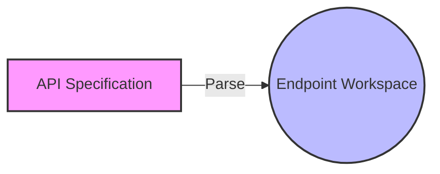
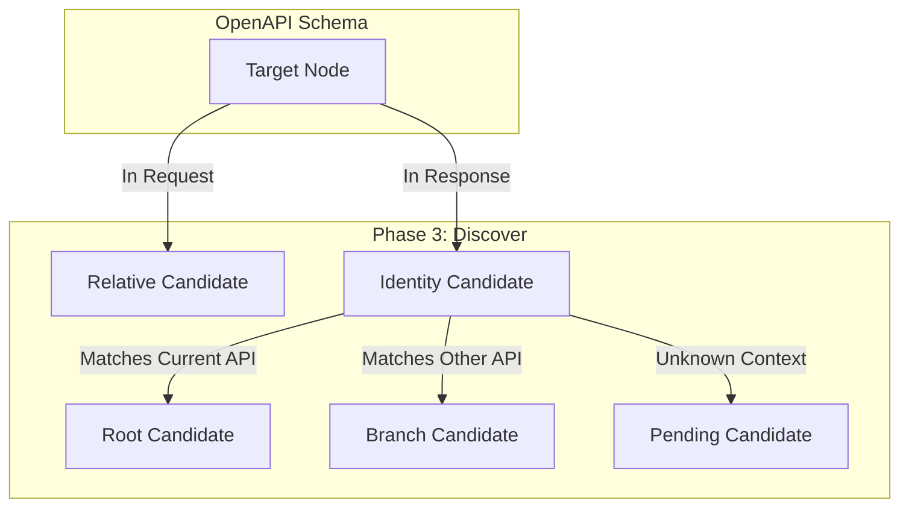
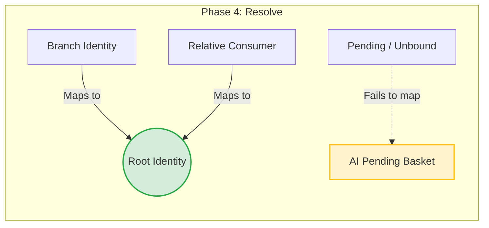
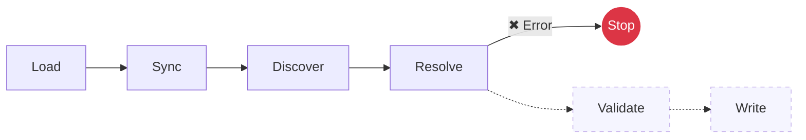

# Overview

The `blaster parse` command transforms an API specification into a deterministic Endpoint workspace. The lifecycle is deterministic, incremental, and non-destructive.

---

# Pipeline

The Parse lifecycle consists of seven sequential phases. Each phase has a strictly isolated responsibility. Every phase produces a deterministic workspace for the next phase.

---

# Phase 1 — Load

Loads the API specification and prepares it for deterministic processing.

## Responsibilities

- Parse the source document (OpenAPI, etc.).
- Normalize and flatten the hierarchical model.
- Deterministic Sort: Sort operations by path depth (shallow before deep) and HTTP method (e.g., GET > POST). This guarantees that canonical endpoints are always processed before derived endpoints.

**Output:** Normalized OpenAPI Model

---

# Phase 2 — Synchronize

Synchronizes existing Endpoint files from the disk with the latest API structure.

## Responsibilities

- Create missing files.
- Remove obsolete generated data.
- Preserve explicit manual fields (e.g., locked targets, ignore).
- Preserve manual files.

**Output:** Working Endpoint (Locked State)

---

# Phase 3 — Discover

Discovers semantic information that can be inferred deterministically, without creating actual relationships. Discovery **MUST NOT** modify manual data.

Examples of discovered entities:

- Identity Candidates (Root / Branch)
- Relative Candidates
- Pending (?)

---

# Phase 4 — Resolve

Resolves the discovered relationships and builds the Canonical Identity Graph. Unresolved items remain Pending (`?`).

## Responsibilities

- Resolve Relatives to Root Identities.
- Resolve Branch Identities to Root Identities.
- Validate Identity graph integrity.
- Detect semantic conflicts.

---

# Phase 5 — AI (Optional)

AI may assist in semantic discovery for unresolved (`?`) Target Nodes. AI **NEVER** replaces deterministic results.

AI **MAY**:

- Suggest Identity mappings.
- Suggest Relative mappings.
- Explain ambiguity.

AI **MUST NOT**:

- Overwrite confirmed/locked data.
- Modify deterministic relationships established in Phase 4.

---

# Phase 6 — Validate

Validates the complete Endpoint workspace before writing (Gatekeeping). Validation reports problems but does not modify Endpoint files natively (except downgrading invalid manual references safely back to Pending).

Validation includes detecting:

- Duplicate identities.
- Invalid relatives.
- Orphan branches.
- Invalid or dangling references.
- Consistency checks.

---

# Phase 7 — Write

Persists the Endpoint workspace back to the filesystem. Generated output **MUST** be identical when the input has not changed.

Write **MUST**:

- Preserve user comments natively via AST.
- Preserve formatting and spacing.
- Preserve manual fields.
- Produce deterministic structural ordering.

---

# Lifecycle Rules

| Rule | Description |
|------|-------------|
| Deterministic | Same input → same output. |
| Incremental | Only affected files change. |
| Non-destructive | Manual data (comments, locked targets) is completely preserved. |
| Isolated | Each phase has one single responsibility. |
| Repeatable | Parse can run multiple times safely without corrupting the workspace. |

---

# Error Handling

Errors terminate the current phase immediately (Fail-Fast). Previous completed phases remain unchanged.

---

Every phase produces a deterministic workspace for the next phase. The final Endpoint workspace becomes the canonical semantic representation of the API.