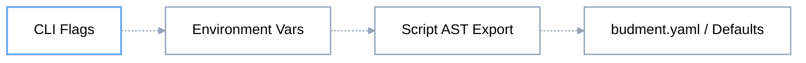

---

title: CLI Command Reference
description: Complete specification of Budment CLI subcommands, persistent flags, configuration precedence, tree inspection, and CI/CD exit codes.
---

# CLI Command Reference

```bash
budment [command] [flags]
```

## 1. Global Persistent Flags

Global flags govern runtime telemetry, output formats, and environment detection across all subcommands.

| **Flag**   | **Shorthand** | **Type** | **Default**      | **Description**                                                                                                               |
| ---------- | ------------- | -------- | ---------------- | ----------------------------------------------------------------------------------------------------------------------------- |
| `--config` | `-c`          | `string` | `"budment.yaml"` | Path to the global project configuration file.                                                                                |
| `--debug`  |               | `bool`   | `false`          | Enables verbose debug logging, prints raw AST JSON, prints the summarized execution tree, and automatically disables the TUI. |
| `--quiet`  | `-q`          | `bool`   | `false`          | Completely suppresses interactive UI and console output. Exclusively returns Exit Codes.                                      |
| `--json`   |               | `bool`   | `false`          | Emits execution plans, metrics, and logs in structured JSON format for automated ingestion, disabling the TUI.                |
| `--no-tui` |               | `bool`   | `false`          | Explicitly disables the terminal user interface (automatically active in CI/Non-TTY environments).                            |

## 2. Configuration Precedence Matrix

When overlapping settings are declared across multiple layers, the Budment engine resolves the final execution configuration using a strict four-tier hierarchy:



## 3. budment plan

The `plan` command evaluates the scenario file in an isolated planning VM and compiles it into an immutable Directed Acyclic Graph (DAG) without triggering real network I/O.

**Bash**

```bash
budment plan <script-path> [flags]
```

### Command Flags

| **Flag**     | **Shorthand** | **Type** | **Default** | **Description**                                                                                                     |
| ------------ | ------------- | -------- | ----------- | ------------------------------------------------------------------------------------------------------------------- |
| `--vus`      | `-v`          | `int`    | `1`         | Overrides the target Virtual Users declared in the script.                                                          |
| `--duration` | `-d`          | `string` | `"0s"`      | Overrides the target execution window (e.g., `30s`, `5m`).                                                          |
| `--detail`   |               | `bool`   | `false`     | Displays the complete nested lifecycle tree, including internal standalone nodes (e.g., `sleep`, `log`, `barrier`). |

### Execution Tree Visualization

By default (without `--detail`), Budment prints a **Summarized Topology Tree** that filters out standalone operational nodes, focusing only on structural control flows (`ACTION`, `BRANCH`, `LOOP`, `MATCH`, `POLL`). Nested hooks (like `.before()` and `.after()`) are collapsed into summarized strings (e.g., `before → set, log, barrier`).

Passing `--detail` forces the engine to recursively print every single pipeline step, revealing isolated scripts, metric counters, and exact hook parameters.

### Practical Examples

**Bash**

```bash
# 1. Inspect the summarized structural topology
budment plan scenarios/checkout.ts

# 2. Inspect full AST graph with all operational nodes and hook details
budment plan scenarios/checkout.ts --detail

# 3. Export compiled AST graph as raw JSON
# Output includes: target, compile_time_ms, resolved_config, and scenarios.
budment plan scenarios/checkout.ts --json

# 4. Dry-run plan with concurrency overrides
budment plan scenarios/checkout.ts --vus 50 --duration 2m
```

## 4. budment run

The `run` command executes the scenario through the native Go runtime engine. Virtual Users traverse the execution graph and generate actual network traffic.

**Bash**

```bash
budment run <script-path> [flags]
```

### Command Flags

| **Flag**     | **Shorthand** | **Type** | **Default** | **Description**                                                                 |
| ------------ | ------------- | -------- | ----------- | ------------------------------------------------------------------------------- |
| `--vus`      | `-v`          | `int`    | `1`         | Number of concurrent Virtual Users spawned during execution.                    |
| `--duration` | `-d`          | `string` | `"0s"`      | Total execution time limit. If `"0s"`, executes until target iterations finish. |
| `--detail`   |               | `bool`   | `false`     | Prints the detailed lifecycle tree alongside terminal summary reports.          |

### Practical Examples

**Bash**

```bash
# 1. Standard execution with interactive Live TUI dashboard
budment run scenarios/auth_flow.ts

# 2. Scale concurrency directly from the command line
budment run scenarios/auth_flow.ts --vus 100 --duration 5m

# 3. Real-time debugging: view socket errors, hook mutations, and payload traces
# Note: --debug automatically prints the execution tree before running.
budment run scenarios/auth_flow.ts --debug

# 4. Non-interactive run for remote SSH sessions
budment run scenarios/auth_flow.ts --no-tui
```

## 5. CI/CD Automation & Quality Gates

Budment is engineered for seamless operation within headless CI runners (such as GitHub Actions, GitLab CI, Jenkins, and Argo Workflows).

### Headless Mode & Detection

The engine automatically suppresses the interactive terminal dashboard and switches to streaming stdout logs when any of the following conditions are met:

* Standard output is redirected to a pipe or file (`!term.IsTerminal()`).
* Common CI environment variables are detected: `CI=true`, `CONTINUOUS_INTEGRATION=true`, or `BUILD_NUMBER`.
* The `--no-tui`, `--quiet`, `--json`, or `--debug` flag is explicitly passed.

### Exit Code Specification

Pipeline quality gates depend on deterministic exit codes to enforce SLA compliance:

| **Exit Code** | **Status**  | **Description**                                                                                                 |
| ------------- | ----------- | --------------------------------------------------------------------------------------------------------------- |
| **`0`**       | **SUCCESS** | All scenarios completed and **100% of defined SLA thresholds passed**.                                          |
| **`1`**       | **FAILURE** | Execution failed due to script compilation errors, network crashes, or **one or more SLA thresholds breached**. |

### Recommended CI Commands

**Bash**

```bash
# Recommended: Prints clean text summary and fails with Exit Code 1 if SLAs fail
budment run scenarios/load_test.ts --no-tui

# Silent quality gate: Returns only the exit code without writing to stdout
budment run scenarios/load_test.ts --quiet
```
